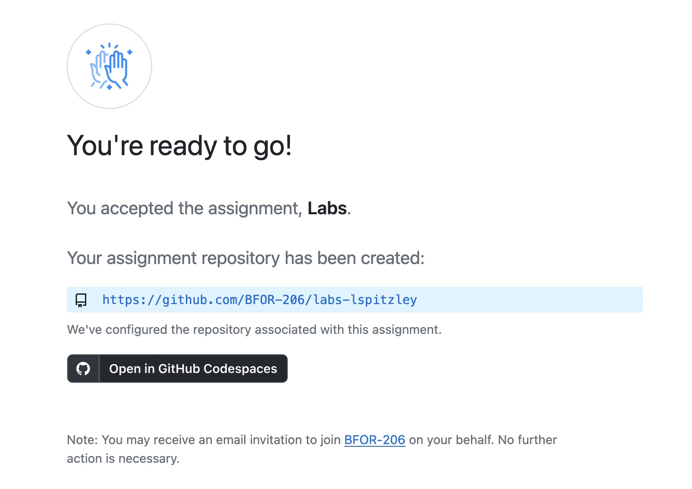

# BFOR 206 Lab

## Class 1-1: Github Setup

## Task Description

Create a GitHub account (if needed), then create a repository
using GitHub Classroom. The link to create a repository to work from
is at this link:
[Join "Labs" Assignment](https://classroom.github.com/a/v_lsvFmw)

This is a place where you commit your work for each day of class.
You will first see a screen asking you to accept the assignment:

After accepting, you will be able to open your repository on GitHub
Codespaces or clone it to your local machine.

## Input

There is no input for this lab.

## Output

There is no output for this lab.

## Submission instructions

Please show the instructor your GitHub repository open in Visual Studio Code
(either on Codespaces or cloned locally).

It should look similar to this:

